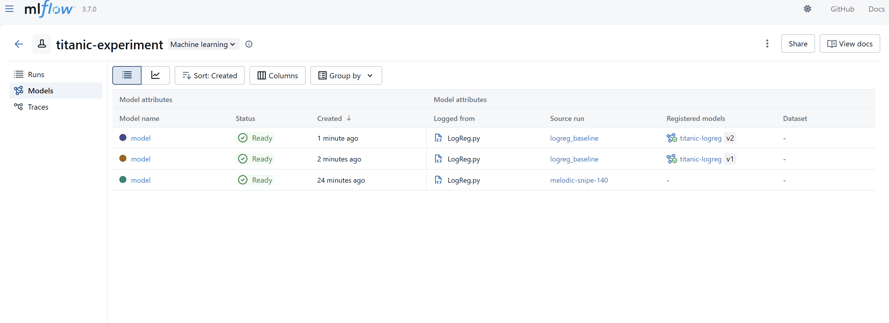
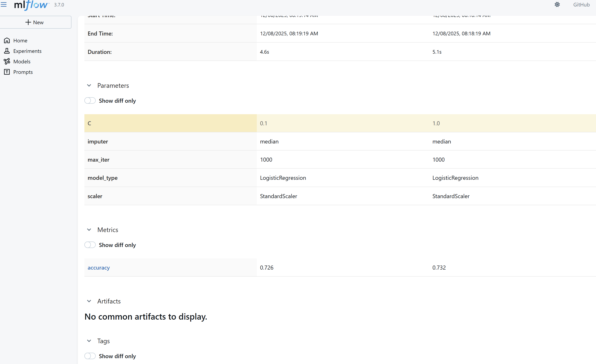

# Отчёт по Домашнему Заданию №2  

## Версионирование данных и моделей 

---

# 📘 Содержание
1. [Выбор инструментов](#выбор-инструментов)
2. [Версионирование данных — DVC](#версионирование-данных-—-dvc)
3. [Версионирование моделей — MLflow](#версионирование-моделей-—-mlflow)
4. [Воспроизводимость](#воспроизводимость)
5. [Заключение](#заключение)

---

# Выбор инструментов

## Инструмент для версионирования данных: **DVC**

Причины выбора:
- простая интеграция с Git  
- поддержка локального remote-хранилища  
- удобная работа с большими файлами  
- широко используется в ML-проектах  

## Инструмент для версионирования моделей: **MLflow**

Причины выбора:
- хранение версий моделей  
- логирование параметров, метрик и артефактов  
- удобный UI для анализа и сравнения  
- автоматическое создание версий  

---
# Версионирование данных — DVC

### 1. Установка DVC и инициализация

```bash
pixi add dvc
pixi run dvc init
```

### 2. Remote storage

```bash
pixi run dvc remote add -d localstore dvc_storage
```

### 3. Добавление данных

```bash
pixi run dvc add data/raw/train.csv
pixi run dvc add data/processed/train_clean.csv
```

### 4. Проверка работы

- Для проверки работы я создала простой файл по очитске данных в /src/data.
- Сначала запустила очистку без удаление nan и сохранила версию очищенного файла в dvc. 
- После добавила замену nan значений пересоздала файл и также затрекала dvc.
- После командой 
```bash
pixi run dvc diff HEAD~1 HEAD
```
проверила, что видны различия

### 5. Получение данных

```bash
pixi run dvc pull
```

---

# Версионирование моделей — MLflow

### 1. Настройка MLflow
```
pixi add mlflow
```

### 2. Настройка логирования

Я обучила простую модель логистической регрессии (src/models/LogReg) с несколькими параметрами. И внутри настроила логирование.

- Установка эксперимента
```python
mlflow.set_experiment("titanic-experiment")
```

- Логирование модели и параметров

```python
mlflow.log_param("C", C)
mlflow.log_metric("accuracy", accuracy)

mlflow.sklearn.log_model(
    model,
    artifact_path="model",
    registered_model_name="titanic-logreg"
)
```

- Версии моделей: Версии создаются автоматически в Model Registry.

- Сравнение моделей: Через MLflow UI: Experiment → выбрать 2–3 запуска → **Compare**.

### 3. MLflow UI
```pixi run mlflow ui```

1. MLflow UI с экспериментами

2. Сравнение моделей

---

# Воспроизводимость

### 1. Инструкции по воспроизведению

a) Клонирование репозитория, переключение на нужную ветку, установка зависимостей
```bash
git clone https://github.com/MaryKuznet/Engineering-practices-in-ML.git
cd Engineering-practices-in-ML
git checkout Homework_2
pixi install
```
pixi install может не заработать, если у вас не установлен pixi. Тогда сначала установите pixi -> [инструкция](https://pixi.prefix.dev/latest/#__tabbed_1_2)

b) Загрузка данных с помощью dvc

```bash
pixi run dvc pull
```

c) Обучим модель и посмотрим результаты в mlflow

```bash
pixi run python src/models/LogReg.py
pixi run mlflow ui
```

### 2. Фиксация зависимостей

Используется Pixi:  
- `pixi.toml`  
- `pixi.lock`

### 3. Docker контейнер и воспроизведение через него

Сам файл можно посмотреть в корне проекта. Добавила туда:
- установку pixi
- sh файлы для автоматического исполнения скрипта:
  - исполнение dvc pull
  - исполнение кода обучения модели
  - запуск ui mlflow

**Чтобы воспроизвести решение через docker:**

**Примечание**: Долго собирается и запускается, рекомендую первый вариант

- Склонируйте репозиторий и переключитесь в новую ветку
```bash
git clone https://github.com/MaryKuznet/Engineering-practices-in-ML.git
cd Engineering-practices-in-ML
git checkout Homework_2
pixi install
```
- соберите контейнер
```bash
docker build --no-cache -t ml-dvc .
```
- запустите контейнер
```bash
docker run --rm -it `
  -p 5000:5000 `
  -v ${PWD}\dvc_storage:/dvc_storage `
  -v ${PWD}\mlruns:/app/mlruns `
  ml-dvc
```
- ui mlflow будет по ссылке http://localhost:5000
---

# Заключение

Настроено:
- версионирование данных (DVC)  
- версионирование моделей (MLflow)  
- сравнение моделей  
- воспроизводимость  
- Docker-контейнер  
- оформлен отчёт  

