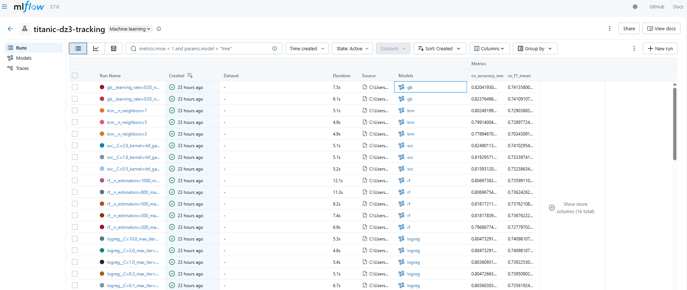
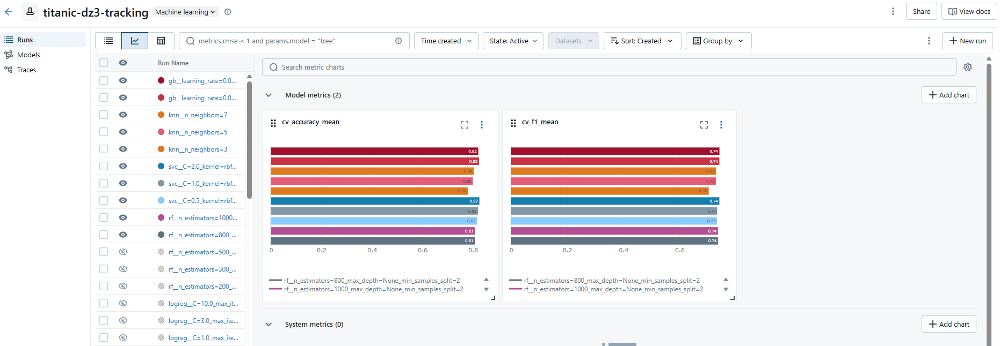
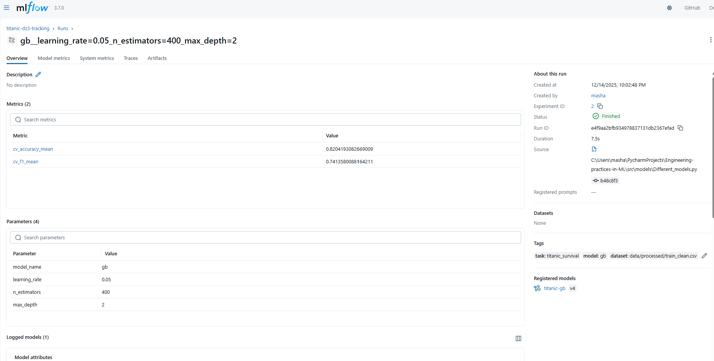
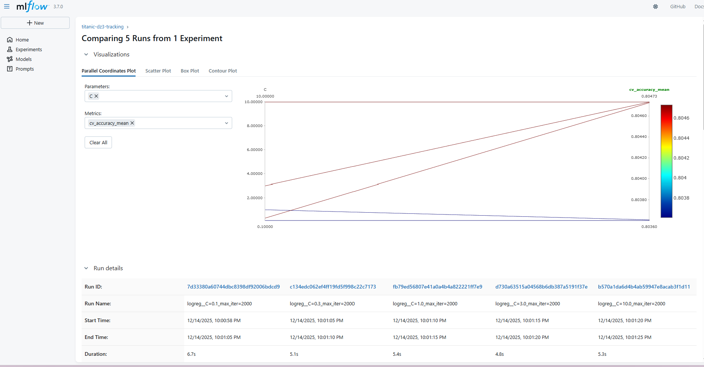

# Отчёт по Домашнему Заданию №3 

## Трекинг экспериментов

---

## 📘 Содержание
1. [Выбор инструмента](#выбор-инструмента)
2. [Настройка MLflow](#настройка-mlflow)
3. [Проведение экспериментов](#проведение-экспериментов)
4. [Интеграция с кодом](#интеграция-с-кодом)
4. [Воспроизводимость](#воспроизводимость)
5. [Скриншоты](#скриншоты)
5. [Заключение](#заключение)

---

## Выбор инструмента

В качестве инструмента для трекинга экспериментов выбран **MLflow**, так как он:
- поддерживает логирование параметров, метрик и артефактов;
- предоставляет удобный UI для сравнения экспериментов;
- содержит Model Registry для управления версиями моделей;
- может быть развернут локально без облачных сервисов.

---

## Настройка MLflow

### Установка и настройка
MLflow установлен с использованием пакетного менеджера Pixi:

```bash
pixi add mlflow
```

### Настройка базы данных и хранилища
Для хранения метаданных экспериментов используется **SQLite backend**, а для артефактов — локальное файловое хранилище:

- backend store: `mlflow.db`

Запуск MLflow Tracking Server:

```bash
pixi run mlflow server   --backend-store-uri sqlite:///mlflow.db  --host 127.0.0.1   --port 5000
```

Файлы `mlflow.db` и директория `mlartifacts/` не коммитятся в Git.

### Создание проекта и экспериментов
Создан эксперимент:

```python
mlflow.set_experiment("titanic-dz3-tracking")
```

Каждый запуск обучения модели логируется как отдельный MLflow run с уникальным именем, параметрами, метриками и артефактами.

### Аутентификация и доступ
MLflow сервер запущен локально (`127.0.0.1:5000`) и доступен только на машине разработчика. Отдельная аутентификация не требуется.

---

## Проведение экспериментов

Для работы для начала была сделана дополнительная предобработка данных -> `src/data/prepare_data_new.py` и сохранены новые версии файлов с помощью DVC.

В рамках работы было выполнено **18 экспериментов** с различными моделями и гиперпараметрами:

- Logistic Regression  
- Random Forest  
- Support Vector Machine  
- K-Nearest Neighbors  
- Gradient Boosting  

Для оценки качества использовалась **Stratified K-Fold Cross-Validation (5 фолдов)**.

Логируемые метрики:
- `cv_accuracy_mean`
- `cv_f1_mean`

Для каждого эксперимента логируются:
- параметры модели;
- метрики качества;
- артефакты (обученная модель, список признаков).

MLflow UI используется для сравнения, фильтрации и сортировки экспериментов.

---

## Интеграция с кодом

Для интеграции MLflow с кодовой базой реализован модуль `mlflow_utils.py`, содержащий:
- централизованную настройку MLflow;
- контекстный менеджер для MLflow run;
- декоратор `@track_experiment` для автоматического логирования параметров и метрик;
- утилиты для логирования моделей.

Эксперименты запускаются командой:

```bash
pixi run python -m src.models.Different_models
```

---

## Воспроизводимость

Для обеспечения воспроизводимости:
- зафиксированы версии зависимостей (`pixi.toml`, `pixi.lock`);
- используется версионирование данных через DVC;
- все эксперименты запускаются одной командой;
- результаты доступны через MLflow UI.

### 1. Инструкции по воспроизведению

a) Клонирование репозитория, переключение на нужную ветку, установка зависимостей
```bash
git clone https://github.com/MaryKuznet/Engineering-practices-in-ML.git
cd Engineering-practices-in-ML
git checkout Homework_3
pixi install
```
pixi install может не заработать, если у вас не установлен pixi. Тогда сначала установите pixi -> [инструкция](https://pixi.prefix.dev/latest/#__tabbed_1_2)

b) Загрузка данных с помощью dvc

```bash
pixi run dvc pull
```

c) Обучим разные модели и посмотрим результаты в mlflow

```bash
pixi run python -m src.models.Different_models
pixi run mlflow server \
  --backend-store-uri sqlite:///mlflow.db \
  --host 127.0.0.1 \
  --port 5000
```
d) Открываем MLflow UI в браузере: http://127.0.0.1:5000 и смотрим результаты

### 2. Инструкции по воспроизведению через Docker

**Чтобы воспроизвести решение через docker:**

**Примечание**: Долго собирается и запускается, рекомендую первый вариант

- Склонируйте репозиторий и переключитесь в новую ветку
```bash
git clone https://github.com/MaryKuznet/Engineering-practices-in-ML.git
cd Engineering-practices-in-ML
git checkout Homework_3
```
- соберите контейнер
```bash
docker build --no-cache -t ml-dvc-2 .
```
- запустите контейнер
```bash
docker run --rm -it `
  -p 5000:5000 `
  -v ${PWD}\dvc_storage:/dvc_storage `
  ml-dvc-2
```

[//]: # (  -v ${PWD}\mlruns:/app/mlruns `)
- ui mlflow будет по ссылке http://127.0.0.1:5000
---

## Скриншоты

В отчёт добавлены скриншоты:
1. MLflow UI с экспериментом и 15+ runs;(Тут же можно сортировать и фильтровать)


2. Страница конкретного запуска.

3. Сравнение экспериментов (Compare)


---

# Заключение

В рамках работы была:
- настроена система трекинга экспериментов с использованием MLflow
- проведена серия экспериментов с различными моделями и гиперпараметрами
- сделана интеграция с кодом
- обеспечена воспроизводимость   
- оформлен отчёт  
