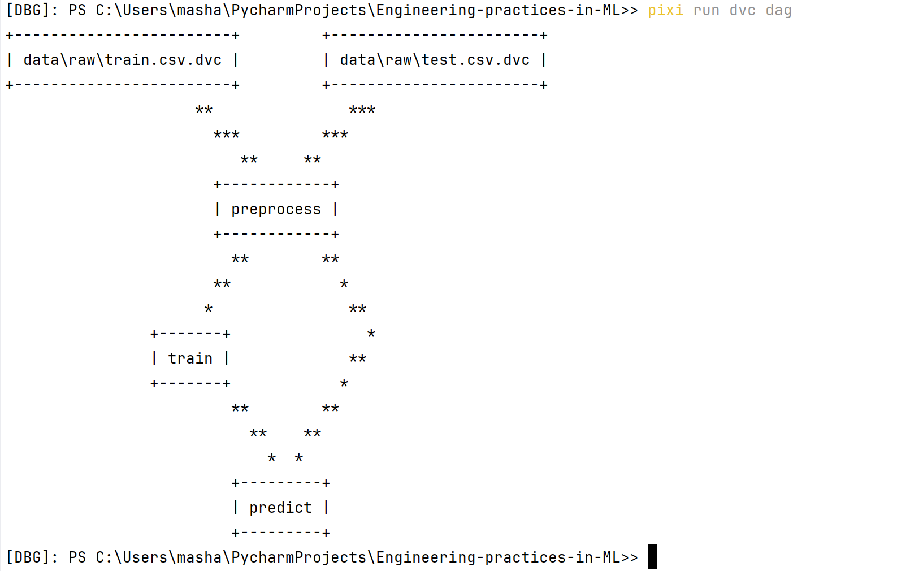

# Отчёт по Домашнему Заданию №4

## Автоматизация ML пайплайнов

## Общая информация

В рамках данного задания был реализован автоматизированный ML пайплайн для задачи предсказания выживаемости пассажиров (Titanic).  
Основной упор сделан на воспроизводимость, автоматизацию и прозрачность выполнения пайплайна.

### Выбранные инструменты
- **Оркестрация пайплайнов:** DVC Pipelines
- **Управление конфигурациями:** Hydra
- **Среда выполнения:** pixi

---

## Оркестрация ML пайплайна (DVC)

### Установка и настройка
DVC был инициализирован в корне репозитория и использован для описания пайплайна в файле `dvc.yaml`.  
Все данные и артефакты пайплайна отслеживаются с помощью DVC, а состояние пайплайна фиксируется в `dvc.lock`.

### Workflow пайплайна
Пайплайн состоит из следующих этапов:

1. **preprocess**
   - Входные данные: `data/raw/train.csv`, `data/raw/test.csv`
   - Выходные данные:
     - `data/processed/train_clean.csv`
     - `data/processed/test_clean.csv`
   - Выполняет очистку и подготовку данных

2. **train**
   - Входные данные: `data/processed/train_clean.csv`
   - Обучает заранее выбранную лучшую модель (исходя из 3-е домашнего задания)  
     (Gradient Boosting с параметрами: `learning_rate=0.05`, `n_estimators=400`, `max_depth=2`)
   - Выходные артефакты:
     - `models/model.pkl`
     - `reports/train_reports/train_info.json`

3. **predict**
   - Входные данные:
     - `models/model.pkl`
     - `data/processed/test_clean.csv`
   - Формирует файл предсказаний:
     - `data/predictions/submission.csv`

Граф пайплайна можно просмотреть командой:
```bash
pixi run dvc dag
```

---

### Зависимости между этапами
Зависимости между этапами описаны через `deps` и `outs` в `dvc.yaml`.  
DVC автоматически определяет, какие стадии необходимо пересчитывать при изменении данных, кода или конфигураций.

---

### Кэширование и параллельное выполнение
- DVC использует встроенный механизм кэширования результатов стадий.
- При повторном запуске пайплайна без изменений выводится сообщение:
  ```
  Data and pipelines are up to date.
  ```
- Для запуска пайплайна используется команда:
```bash
pixi run dvc repro 
```

---

## Управление конфигурациями (Hydra)

### Настройка Hydra
Hydra используется для централизованного управления параметрами пайплайна.  
Конфигурации хранятся в директории `conf/`.

Основные конфигурационные группы:
- `data` — пути к данным и артефактам
- `model` — параметры выбранной модели

Главный конфигурационный файл:
```
conf/config.yaml
```

### Валидация конфигураций
Используется structured config (`src/config.py`), что обеспечивает:
- наличие обязательных параметров
- защиту от опечаток и лишних полей
- раннее обнаружение ошибок конфигурации

При некорректной конфигурации выполнение пайплайна завершается с ошибкой.

### Композиция конфигураций
Hydra использует механизм `defaults`, что позволяет гибко расширять проект и добавлять новые конфигурации без изменения кода.

---

## Интеграция и тестирование

### Интеграция DVC и Hydra
- DVC запускает Python-скрипты пайплайна
- Каждый скрипт читает параметры из Hydra-конфигураций
- Директория `conf/` добавлена в зависимости стадий DVC, поэтому изменение конфигураций приводит к пересчёту соответствующих этапов

### Уведомления о результатах
Информация о завершении обучения и расположении артефактов выводится в консоль, а также сохраняется в виде файлов (`train_info.json`, `submission.csv`).

### Воспроизводимость
Воспроизводимость проверена следующим образом:

Стандартная подготовка:

1. Клонирование репозитория, переключение на нужную ветку, установка зависимостей
```bash
git clone https://github.com/MaryKuznet/Engineering-practices-in-ML.git
cd Engineering-practices-in-ML
git checkout Homework_4
pixi install
```
pixi install может не заработать, если у вас не установлен pixi. Тогда сначала установите pixi -> [инструкция](https://pixi.prefix.dev/latest/#__tabbed_1_2)

2. Загрузка данных с помощью dvc

```bash
pixi run dvc pull
```

Запуск пайплайна:
1. Выполнен полный запуск пайплайна:
```bash
pixi run dvc repro
```
2. Повторный запуск без изменений:
```bash
pixi run dvc repro
```
При этом пайплайн не пересчитывается, что подтверждает корректную работу кэширования.

---

## Выводы

В рамках работы был реализован полностью автоматизированный и воспроизводимый ML пайплайн:
- Использована современная оркестрация с помощью DVC
- Настроено централизованное управление конфигурациями через Hydra
- Обеспечена воспроизводимость экспериментов
- Все результаты сохраняются в виде версионируемых артефактов

Репозиторий содержит все необходимые файлы для воспроизведения результатов.
