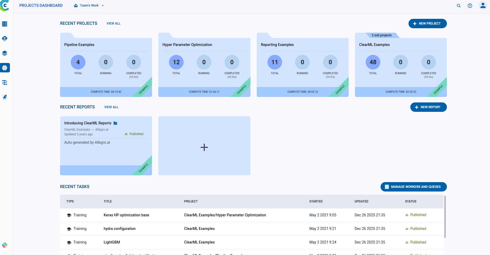
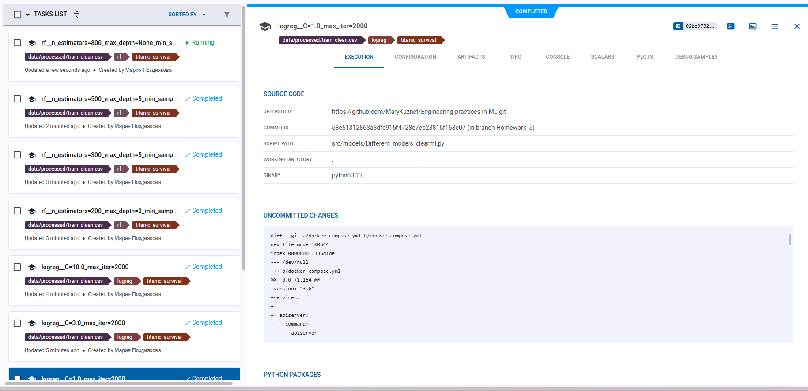
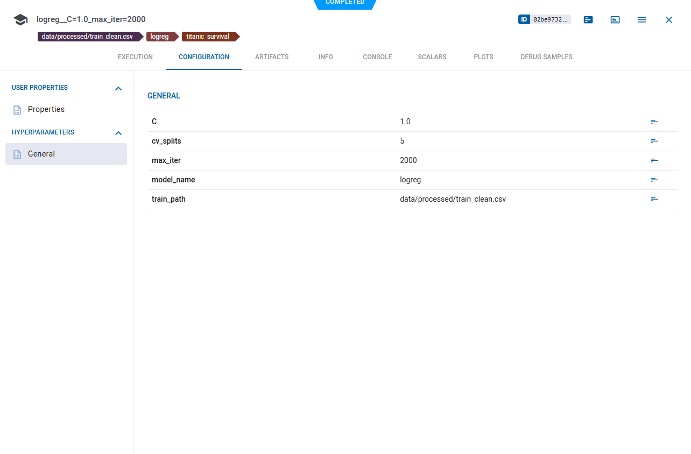
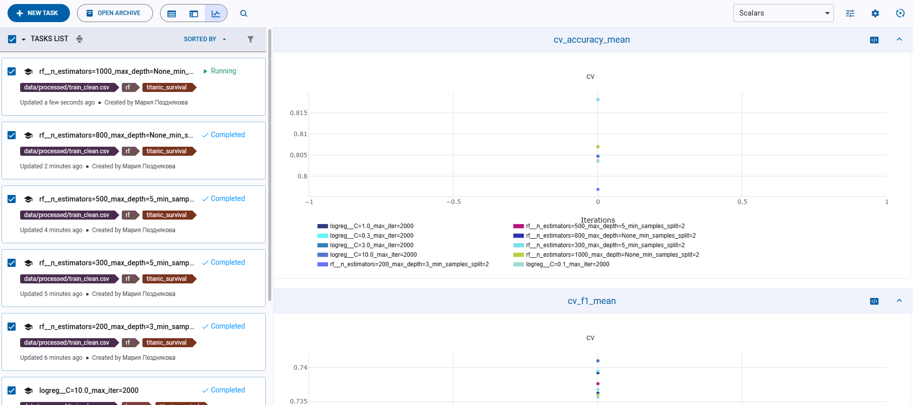
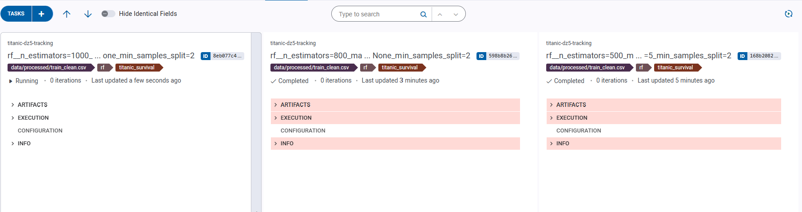
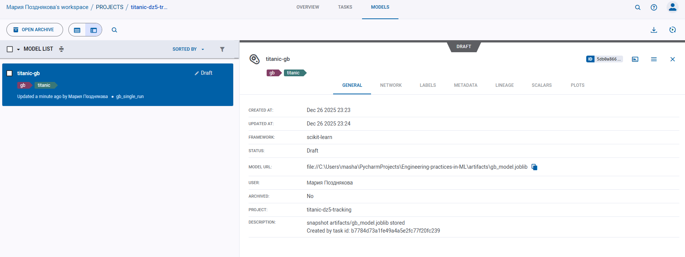

# ДЗ 5 — ClearML для MLOps

## 1. Развертывание ClearML Server

### 1.1 Используемые компоненты
ClearML Server был развернут локально с помощью Docker Compose и включает:
- ClearML Web Server (UI)
- ClearML API Server
- MongoDB — хранение метаданных
- Elasticsearch — поиск и индексация
- Redis — очереди и кэш
- ClearML File Server — хранение артефактов

### 1.2 Запуск
Развертывание выполнялось командой:

```bash
docker compose up -d
```

Запуск выполнялся из **PowerShell**, так как compose-файл использует Windows-специфичную конфигурацию.

### 1.3 Устранение проблем
В процессе развертывания возникли сложности с запуском Elasticsearch:
- контейнер Elasticsearch стартовал, но сервис не поднимался;
- API Server не мог подключиться к Elasticsearch.

Также сходу креды не принимались.

---

## 2. Настройка аутентификации ClearML SDK

После запуска UI были созданы пользовательские **App Credentials**.

Инициализация SDK:

```bash
clearml-init
```

Используемые хосты:

```
Web:   http://127.0.0.1:8080
API:   http://127.0.0.1:8008
Files: http://127.0.0.1:8081
```

---

## 3. Трекинг экспериментов

Треккинг настроен в 2-х файлах.
1. Обучение многих моделей с разными параметрами
```
pixi run python -m src.models.Different_models_clearml
```
2. Обучение одной модели, с её дальнейшей регистрацией и сохранением большего количества артефактов.
```
pixi run python -m src.models.GB_clearml
```

### 3.1 Эксперименты
Каждый запуск обучения регистрируется как ClearML Task.

Автоматически логируются:
- git commit и diff;
- окружение;
- stdout / stderr;
- параметры запуска.

### 3.2 Параметры и метрики
Параметры модели логируются через `task.connect()`.

Метрики:
- Accuracy (CV OOF)
- F1-score
- ROC-AUC

Метрики отображаются в UI и используются для сравнения экспериментов.

### 3.3 Артефакты
В Task сохраняются:
- confusion matrix (PNG);
- metrics.csv;
- список признаков;
- файл модели.

---

## 4. Управление моделями

```
pixi run python -m src.models.GB_clearml
```

### 4.1 Регистрация модели
Модель регистрируется в ClearML Model Registry с помощью `OutputModel`.

### 4.2 Версионирование
- каждая новая тренировка создаёт новую версию модели;
- версия связана с Task;
- параметры и метрики доступны в UI.

### 4.3 Метаданные
Для моделей сохраняются:
- список признаков;
- параметры обучения;
- CV-метрики.

---

## 5. Воспроизводимость

Для воспроизведения результатов достаточно:

```bash
docker compose up -d
clearml-init
pixi run python -m src.models.GB_clearml.py
```

Все эксперименты и модели воспроизводятся автоматически.
---

## 6. Скриншоты
1. ClearML server

2. Список экспериментов в проекте

3. Конфигурация зарегистрированных параметров

4. В режиме простмотра экспериментов на графиках можно увидеть сравнение метрик для всех экспериментов

5. Можно выбрать несколько моделе и нажать на сравнение, будут показаны различия в параметрах

6. Зарегистрированные модели


---

## Результат 

- настроен ClearML Server;
- реализован трекинг экспериментов;
- настроено управление моделями и версионирование;
- добавлены артефакты и метрики;
- обеспечена воспроизводимость.
